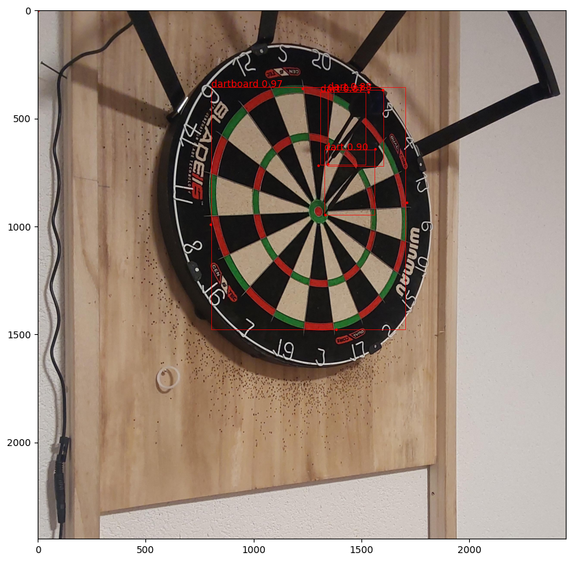
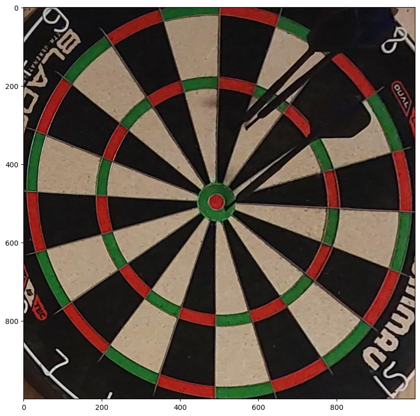

# Scored

## Single Camera automated darts scoring using keypoint detection

The project aims to detect dart scores by using a yolo v11 keypose model on a single camera image to predict the score of the thrown darts.
4 Keypoints on the dartboard, the darts tip and flight are detected.

After detecting the keypoints, the 4 dartboard keypoints are used to apply a perspective transform to warp the perspective in a top down view. With the warped points of the dart tips the score of the dart can easily be calculated by their distance to the center and their angle.

