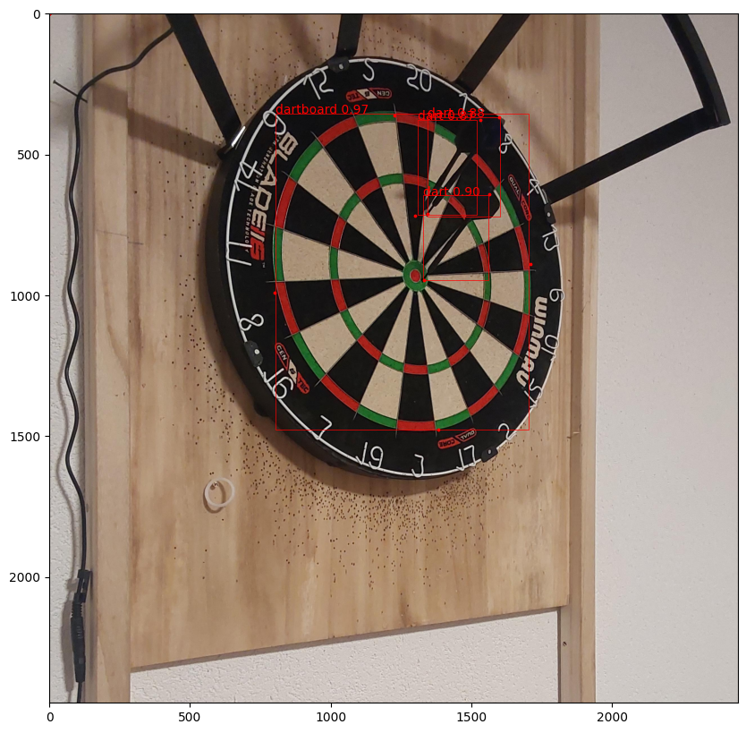
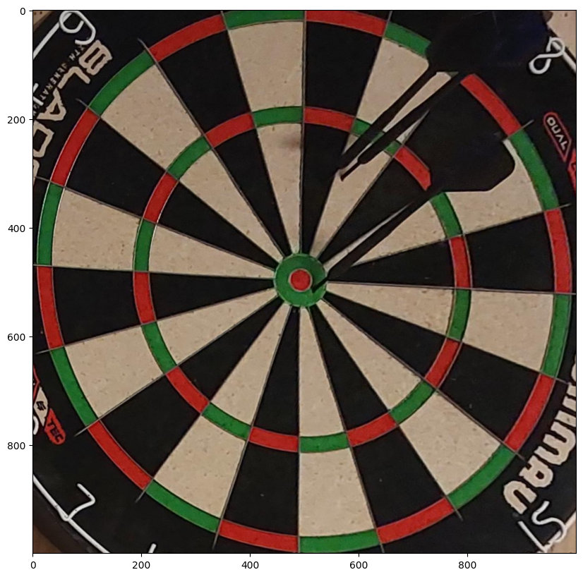

# Scored

## Single Camera automated darts scoring using keypoint detection

The project aims to detect dart scores by using a yolo v11 keypose model on a single camera image to predict the score of the thrown darts.
4 Keypoints on the dartboard, the darts tip and flight are detected.



After detecting the keypoints, the 4 dartboard keypoints are used to apply a perspective transform to warp the perspective in a top down view. With the warped points of the dart tips the score of the dart can easily be calculated by their distance to the center and their angle.



## How to use

This project uses a **Poetry monorepo setup**. Each project has its own `pyproject.toml` inside the respective `projects/<project_name>` folder.

1. Install Poetry if you don’t have it yet:

   ```bash
   pip install poetry
   ```

1. From the top-level project folder, install each package environment:

   ```bash
   poetry install --directory projects/<package_name>
   ```

1. To run scripts defined in pyproject.toml (e.g. evaluation):

   ```bash
   poetry run --directory projects/ml eval <model_path> <dataset_path>
   ```

   Paths are given relative to the top-level folder (recommended) or as absolute paths.

1. To open a shell in the a environment:

    ```bash
    poetry shell --directory projects/<package_name>
    ```

## Training

To see how to train your own model and how to prepare and create a dataset, refer to [Train Instructions](train.md)
