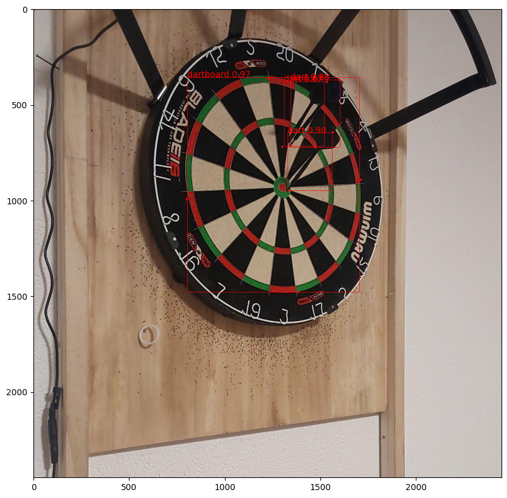
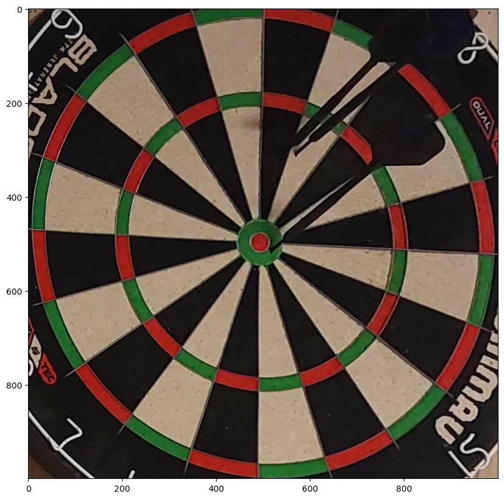

# Scored

> Currently under development, this project is a work in progress. Please check back later for updates.

## Single Camera automated darts scoring using keypoint detection

The project aims to detect dart scores by using a yolo v11 keypose model on a single camera image to predict the score of the thrown darts.
4 Keypoints on the dartboard, the darts tip and flight are detected.



After detecting the keypoints, the 4 dartboard keypoints are used to apply a perspective transform to warp the perspective in a top down view. With the warped points of the dart tips the score of the dart can easily be calculated by their distance to the center and their angle.




## Logging

Logging is set up in `scored_lib.logging_setup`. Call `setup_logging()` once at
startup and then use `import logging` anywhere:

```python
from scored_lib.logging_setup import setup_logging

setup_logging()                      # ./logs/<start time>/scored.log + stderr
setup_logging("logs", "my.log", "DEBUG")
```

Records go to a rotating file (`2 MB` x `5`) and to the console. The level can
be changed at runtime with `set_log_level("DEBUG")`.

## Training

To see how to train your own model and how to prepare and create a dataset, refer to [Train Instructions](train.md)
