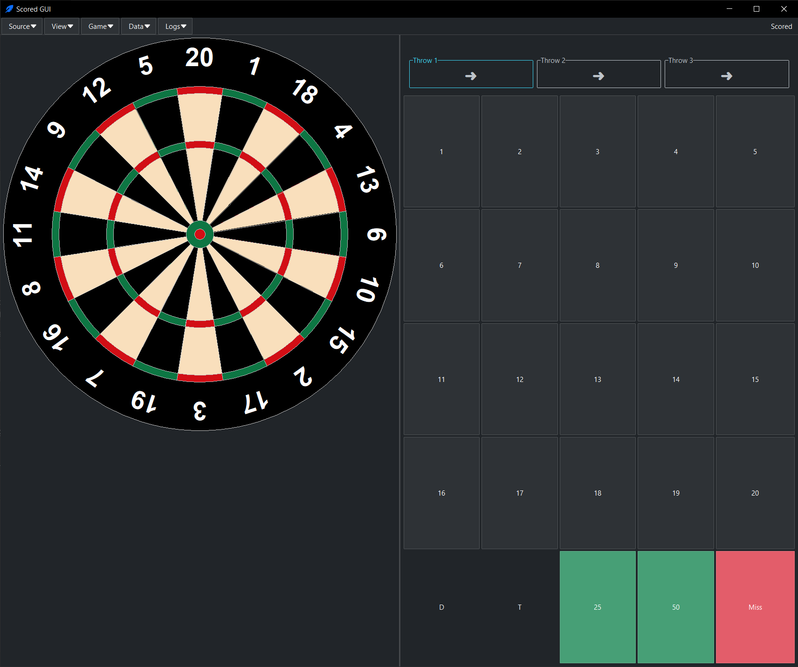

# Scored GUI

A simple tkinter based GUI for the scored project. The GUI is located in the `gui` folder.  

## Usage

To start the GUI, run the following command:

```bash
uv run scored-gui
```
and enabled data collection in the ui by choosing a folder to save the data to or start the gui with data collection enabled by default, run the following command:

```bash 
uv run scored-gui --data_dir <path_to_save_data>
```


## Sources
The GUI accepts different sources for the images. The following sources are currently supported:
- `camera` - uses the default camera of the system to capture images
- `video` - uses a video file as source, the path to the video file must be provided. This is useful for testing the GUI with pre-recorded videos.
- `http` - uses a http stream as source, the url to the stream must be provided. Use this if you want to use a secondary camera (for example an old phone) to make the images will running the application on a different device. The phone must be running an app that provides a http stream, for example the [IP Webcam](https://play.google.com/store/apps/details?id=com.pas.webcam&hl=de&gl=US) app for Android or the [Android IP Webcam](https://f-droid.org/de/packages/com.github.digitallyrefined.androidipcamera/) from F-Droid which is open source and does not have any ads. The url to the stream is usually in the format `http://<ip>:<port>/video`. 

A source can be set in the GUI by clicking on the "Source" button and selecting the desired source. Or during the start of the GUI by using the `--source` argument. For example to use a video file as source, run the following command:

```bash
uv run scored-gui --source <path_to_video_file>
```

## Playing Dart Legs
The app follows the basic rules of darts. To start a game first at the desired players. After words start a game and select desired options for that leg. currently legs must be played one by one there is now best of x legs option. The app will keep track of the scores and display the current score of each player. The app will also display the current player and the current throw. After a leg is finished, the app will display the winner and the scores of each player.

The `dartboard` view can be used to see the dart drawn in a canvas to visualize the throw. A dart can be dragged to a different position on the dartboard, the scores will reflect the new position of the dart. This can be used to correct the position of the dart if the model did not detect it correctly, or for labeling purposes. One can also click at the position where the dart landed to add the dart to the dartboard.

The 'camera feed` view shows the current image from the source, use it for debugging and to see if the images are captured correctly. 

All three views can be rearranged from the "View" menu. Every view has its own entry with a submenu of four options:

- **Left** shows the view in the left column.
- **Right** shows the view in the right column.
- **Floating** gives the view a window of its own, which stays on top of the main window. Closing that window hides the view.
- **Hidden** takes the view off screen.

The window is split into a left and a right column with a draggable divider that cannot be squeezed below what the panels need. A column with no views disappears and the other one takes the whole width. Views in the same column share the height equally.

The layout is remembered between sessions and stored in `layout.json` in the OS user state directory.

## Data Collection

The gui can be used to collect data for training the model. To do this, start a game and select the "Data Collection" option. The app will then save the images and the corresponding scores to a folder. The folder can be specified in the settings. Each Game will create a folder in there each player leg will create a subfolder. Each throw will create a subfolder with the image and a json file containing the scores. Folders are named based on the round and throw number of this throw. For example, the folder structure for a game with two players and two legs will look like this:

```
game_<time>
├── player1
│   ├── 1_1
│   │   ├── annotation.json
│   │   ├── image.jpg
│   ├── 1_2
│   │   ├── annotation.json
│   │   ├── image.jpg
│   ├── 1_3
│   │   ├── annotation.json
│   │   ├── image.jpg
├── player2
│   ├── 1_1
│   │   ├── annotation.json
│   │   ├── image.jpg

```

The image will be saved when the score is entered. So to get the correct image, make sure to enter the score after the dart has landed and before the next throw. The annotation can be changed after the player made its 3 throws, but by default the image will not be overwritten as the image of the first through should only contain one dart and so on. If one changes the first throw after the second throw and the image would be overwritten, the image would contain two darts although only one dart annotation is saved (This behavior can be toggled to also update the image if needed). Annotation with multiple throws on the image will contain multiple annotation data.

If a throw gets removed by default the annotation and image will be marked as deleted with a `_d` prefix but not deleted from the disk. This can be changed in the settings to delete the files instead of marking them as deleted.